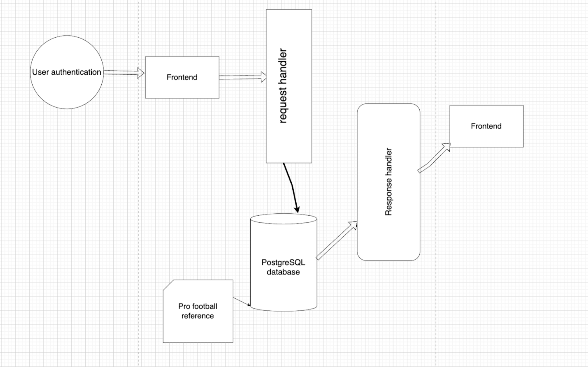

# MVP Fantasy Team 115

Created by Timothy Li, Misho Metodiev, Charlie DeAngelis, Vinay Siva

## Description

Embark on a journey to fantasy football glory with MVP Fantasy—an innovative platform designed to revolutionize how users navigate the complexities of assembling a winning team at the onset of the NFL season. The world of fantasy football is often fraught with challenges, from scouting players to optimizing lineups, but MVP Fantasy rises to the occasion, offering a cutting-edge predictive analytics ecosystem.

MVP Fantasy provides a range of powerful features:

- **Player Insights:** Gain access to a comprehensive list of all active NFL players, allowing you to explore and evaluate the talent pool thoroughly.

- **Search and Filter:** Effortlessly search for specific NFL players based on various criteria such as position and team, streamlining the player selection process.

- **Statistics Overview:** Dive into detailed player statistics from prior seasons, enabling you to make informed decisions based on historical performance.

- **Projected Statistics:** Peer into the future with projected player statistics for upcoming weeks and the entire season, giving you a strategic advantage in planning your lineup.

- **Roster Management:** Assemble and refine your dream team by adding desired players to your roster and making strategic decisions on player drops.

- **Tailored Suggestions:** Receive personalized suggestions to enhance your roster, leveraging the platform's analytics to optimize your chances of success.

MVP Fantasy isn't just a fantasy football tool; it's a game-changer that empowers users with the tools they need to stay ahead of the competition, turning the unpredictable nature of the NFL into a strategic advantage.

Whether you're a seasoned fantasy football veteran or a newcomer eager to elevate your game, MVP Fantasy is your gateway to a dynamic and immersive experience. Unleash the potential of data-driven decision-making, harness the prowess of predictive analytics, and embark on a quest for fantasy football supremacy like never before. The struggle is over—MVP Fantasy is here to redefine your fantasy football journey.

## Technical Architecture

 
## Developers
- **Vinay Siva:**
  - Responsibilities:
    - Implement testing
    - Develop projection model

- **Timothy Li:**
  - Responsibilities:
    - Implement backend endpoints for data scraping
    - Develop projection model

- **Misho Metodiev:**
  - Responsibilities:
    - Firebase integration
    - User authentication

- **Charlie DeAngelis:**
  - Responsibilities:
    - Dark mode
    - General page styling


## Getting Started

### Dependencies

Python, Node.js, NPM


### Executing program

* Clone the github repository
* cd server
* Set up python virtual environment

Mac:
```
python -m venv env
source env/bin/activate
```
Windows:
```
env/Scripts/activate.bat
env/Scripts/Activate.ps1
```
* Ensure that you are in your virtual env. Your terminal should start with (env)
* Install dependencies: ```pip install scikit-learn```
* Install flask:
```pip install flask```
* Run backend: ```python app.py```
  
* Open a new terminal
* cd client
* Run ```npm install```
* Run frontend ```npm start```
